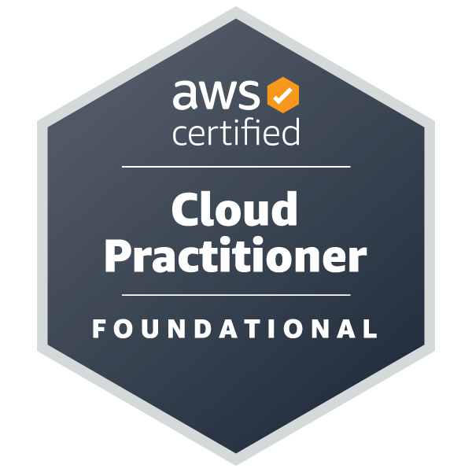
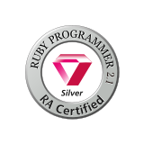
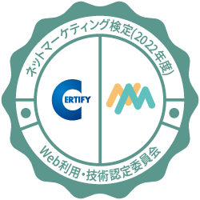

## Skills

### Languages

### Frameworks & libraries

## 🏅 Qualifications

### ITSS - level 2

- Fundamental Information Technology Engineer Certification

### ITSS - level 1

- [Ruby Association Certified Ruby Programmer _Silver version 2.1_](https://www.credential.net/c985f2eb-bcea-4397-8177-51a4a51385db)
- Python 3 Certification _Basic Grammar_
- Python 3 Certification _Data Analyst_

### Other

- [AWS Certified Cloud Practitioner](https://www.credly.com/badges/e27fdaf0-71ca-4964-b9ce-8e4a4dc64951/public_url)
- Japan Statistical Society Certificate _Grade 2_
- Japan Statistical Society Certificate _Data Science Advanced_
- Audio-Visual Postproduction Engineer Certification （映像音響処理技術者資格）
- [ネットマーケティング検定](https://www.openbadge-global.com/api/v1.0/openBadge/v2/Wallet/Public/GetAssertionShare/VTloMEUyd01TNG1DZU41dVR3a1N0Zz09)

---

  
  
  

<!--
**yudukikun5120/yudukikun5120** is a ✨ _special_ ✨ repository because its `README.md` (this file) appears on your GitHub profile.

Here are some ideas to get you started:

- 🔭 I’m currently working on ...
- 🌱 I’m currently learning ...
- 👯 I’m looking to collaborate on ...
- 🤔 I’m looking for help with ...
- 💬 Ask me about ...
- 📫 How to reach me: ...
- 😄 Pronouns: ...
- ⚡ Fun fact: ...
-->
